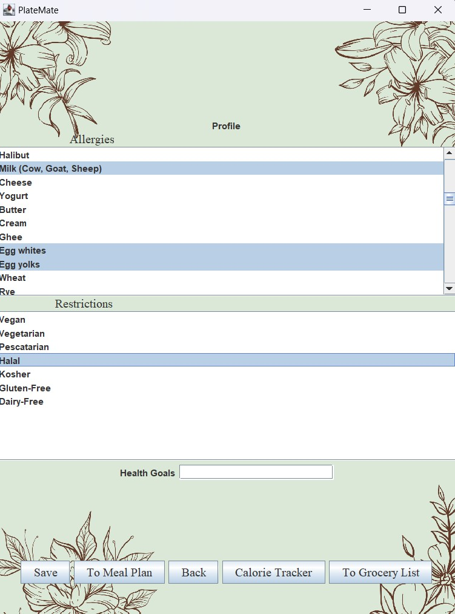
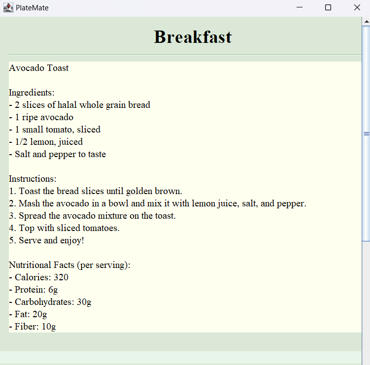
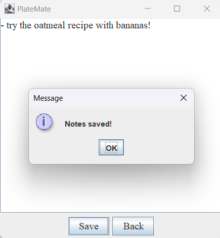
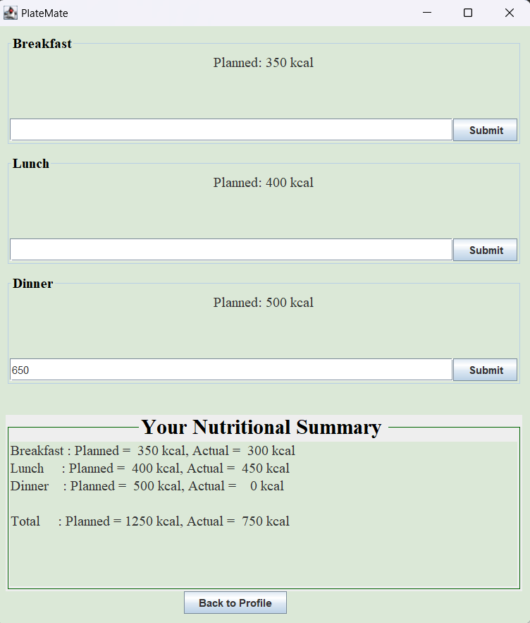
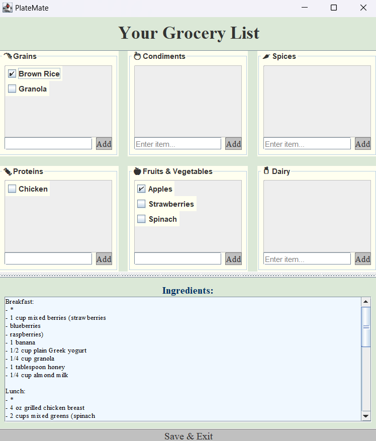
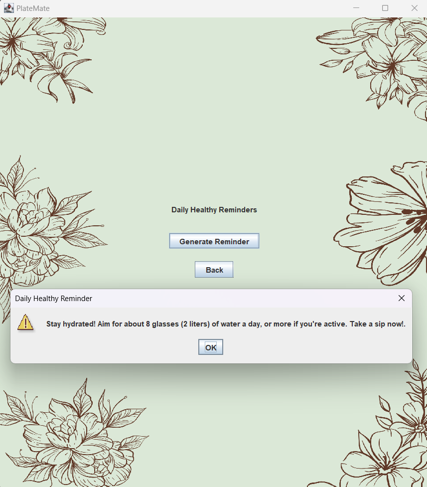

# PlateMate - Personalized Meal Planner
   
### Team Members: <br>
**Mayesha Rahaman - mayesharahaman <br>**
**Aroush Syed - asyed2105 <br>
Fatima Masood - fatima0996 <br>
Melissa Xiao - mxiao86**

# Table of Contents

1. [Summary](#summary)  
   - [Why We Built This Project](#why-we-built-this-project)  
   - [What This Project Does](#what-this-project-does)  
   - [Who It’s For](#who-its-for)  
   - [What Problem Does It Solve](#what-problem-does-it-solve)  
2. [Features](#features)  
   - [1. Personalized One-Day Meal Plan](#1-personalized-one-day-meal-plan)
   - [2. Personal Notes Page](#2-personal-notes-page)  
   - [3. Personalized Daily Calorie Tracker](#3-personalized-daily-calorie-tracker)  
   - [4. Grocery List Organizer](#4-grocery-list-organizer)  
   - [5. Daily Health Reminders](#5-daily-health-reminders)  
3. [Installation Instructions](#installation-instructions)  
   - [1. Prerequisites](#1-prerequisites)  
   - [2. Installation Steps](#2-installation-steps)  
   - [3. Run the Application](#3-run-the-application)  
   - [Common Issues and Fixes](#common-issues-and-fixes)  
4. [User Guide](#user-guide)  
5. [Feedback](#feedback)  
   - [How to Provide Feedback](#how-to-provide-feedback)  
   - [Rules for Valid Feedback](#rules-for-valid-feedback)  
   - [What to Expect After Submitting Feedback](#what-to-expect-after-submitting-feedback)  
6. [Contributions](#contributions)  
   - [How to Contribute](#how-to-contribute)  
   - [Guidelines for Contributions](#guidelines-for-contributions)  
7. [License](#license)


## Summary:
### Why We Built This Project
Ever feel overwhelmed by the idea of eating healthy? Whether it's figuring out what to cook, shopping for the right ingredients, or sticking to your nutritional goals, maintaining a healthy lifestyle can be tough. We’ve been there, too. This project intends to make healthy living easier for everyone. We wanted to create something that not only helps you stay on track but also takes the stress out of planning meals, shopping, and hitting your health goals.

### What This Project Does
Imagine having a personal assistant for your meals and nutrition. That’s what this app is for:
- Set Your Restrictions and Allergies: Need to avoid tree nuts? Eat a vegetarian diet? Save this in your profile, and we'll take it from there.
- Get Daily Challenges: Receive small, manageable challenges like trying new veggies or drinking more water to make healthy habits stick.
- Personalized Meal Plans: Based on your preferences and available ingredients, we’ll suggest recipes that fit your lifestyle.
- Nutritional Tracking: Track your calories, protein, carbs, and fats to see how you’re doing.
We designed this app to fit into your busy life, helping you save time, money, and effort while making healthier choices.

### Who It’s For
This app is for anyone who wants to:
- Wants healthier meals but doesn’t know where to start or have hours to spend planning meals.
- Stay motivated with small, achievable daily goals.
- Struggles to stay consistent with your nutrition.
- Feels overwhelmed by the idea of meal prep and grocery shopping.
- Keep track of their nutrition without the hassle.
- Stay organized with a grocery tracker 
Whether you're a busy professional, a fitness enthusiast, or someone starting their health journey, this app is here to support you.

### What Problem Does It Solve?
Eating healthy can feel complicated, and time-consuming. We simplify the process by giving you all the tools you need in one place. It’s like having a meal planner, a nutritionist, and a personal motivator all in your pocket.

## Features:

### **1. Personalized One-Day Meal Plan**
- Users can generate a custom one-day meal plan tailored to their specific dietary restrictions and allergies.  
- Ensures that all suggested meals align with user preferences and avoid allergens.  
- The plan includes balanced meals for breakfast, lunch, and dinner, helping users stay on track with their dietary goals.  

#### Selecting Profile:                                                                                
 

#### Sample Breakfast Based on Saved Preferences:


### **2. Personal Notes Page:
- Users can add personalized notes based on the generated meal plan and save them.

#### Sample Note:


### **3. Personalized Daily Calorie Tracker**
- Tracks daily calorie intake by comparing:  
  1. **Planned Calories:** Automatically calculated based on the generated meal plan.  
  2. **Actual Calories:** Recorded by users as they input what they eat throughout the day.  
- Provides an easy-to-understand summary of deviations from planned goals, empowering users to adjust their habits.

#### Sample Calorie Tracker Display:



### **4. Grocery List Organizer**
- Allows users to input grocery items they need for their meal plan or personal shopping.  
- Automatically organizes items into six intuitive categories for a streamlined shopping experience:  
  - **Grains**  
  - **Proteins**  
  - **Fruits and Vegetables**  
  - **Spices**  
  - **Condiments**  
  - **Dairy**  
- Helps users keep track of essential ingredients and reduces the hassle of grocery planning.

#### Sample Grocery List:



### **5. Daily Health Reminders**
- A dedicated page generates easy-to-follow, practical health tips to encourage users to stay on a healthy track.  
- Examples of tips include hydration reminders and incorporating more vegetables into meals.  
- Designed to motivate and educate users with small, manageable steps toward better health.

#### Sample Healthy Reminder:


## Installation Instructions
### 1. Prerequisites
Ensure your system meets the following requirements:

- Operating System: Tested on:
  - Windows 10 or higher
  - macOS 10.15 (Catalina) or higher
  - Linux Ubuntu 20.04 or higher
- Java Development Kit (JDK): Version 11 or higher
  - [Download JDK](https://www.oracle.com/java/technologies/downloads/#java11?er=221886)
- Maven: Version 3.6.3 or higher 
  - [Download](https://maven.apache.org/install.html)
 
### 2. Installation Steps 
1. Clone the Repository
```
git clone https://github.com/your-username/your-repo-name.git
cd your-repo-name
```
2. Install Required Dependencies
This project relies on a few libraries to work its magic.Ensure the following Maven dependencies are included in the pom.xml file. 
- OkHttp (v4.10.0): For API requests
- JSON.org Library (v20210307): For JSON parsing
Run the following command to download and install all dependencies:
```
mvn clean install
```
### 3. Run the Application
```
mvn compile

mvn exec:java
```

### Common Issues and Fixes
#### Dependency Download Fails
Error Message:
```
Could not resolve dependencies for project <project-name>.
```
Solution
- Run the following
```
mvn clean install -U
```
### ChatGPT API Setup
1. Obtain an API key from OpenAI.
2. Configure the API key: Add it as an environment variable
```
export OPENAI_API_KEY=sk-your-api-key
``` 
- Alternatively, directly configure it in the code (not recommended for production as you won't be able to commit and push any changes to Github with the secret key).

## User Guide: 

To begin using the software after downloading and logging in, follow these steps. Refer to the images provided in the [Features section](#features) as you go along the guide:

### 1. Access Daily Healthy Reminders:
- After logging in, click the **"Go to Daily Healthy Reminders"** button.
- This will show you a personalized healthy reminder for the day to keep you on track with your health goals.

### 2. Set Dietary Restrictions and Allergies:
- Navigate to the **Profile** section.
- Select your allergies and dietary restrictions by holding down the **control (Windows)** or **command (Mac)** key to select multiple options.
- Click **Save** to update your profile with these preferences.

### 3. View Personalized Meal Plan:
- Click the **"To Meal Plan"** button to view your personalized meal plan.
- This will display a page with your meal plan for the day based on the restrictions and preferences you've selected in your profile.

### 4. Track Your Calories:
- Click the **"Calorie Tracker"** button to open the daily calorie tracker.
- Use the input text boxes to record the actual number of calories consumed for each meal.
- At the bottom, compare your **planned** vs **actual** calorie intake using the summary section.

### 5. Access Grocery List:
- Click the **"To Grocery List"** button to access your grocery list.
- Use the input text boxes to enter any additional groceries you need.
- The **checkbox feature** allows you to mark items you have already stored.
- At the bottom, the **ingredients section** will show you which ingredients are required for the recipes in the generated meal plan.

### 6. Make Personalized Meal Notes:
- Click the **"Make a Note"** button to open the notes feature
- Use the input text boxes to enter the users-personalized notes regarding the meal plan
  
### 7. Navigate Between Views:
- Easily switch between the different sections of the app (Daily Healthy Reminders, Profile, Meal Plan, Calorie Tracker, and Grocery List) using the buttons provided at the bottom of each page.
## Feedback

We welcome your feedback on the software! Your input helps us improve and make the app better for everyone. Here's how you can give feedback:

### How to Provide Feedback:
- **Via Google Forms:** You can provide feedback by filling out our [Google Form](https://docs.google.com/forms/d/e/1FAIpQLSfCjc7IcL2LQ3kBEDCX6j2ZQxOk2f8_7AIspJ98WRZSo0yPlA/viewform?usp=sf_link). This form is quick and easy to complete.

### Rules for Valid Feedback:
To ensure your feedback is constructive and helpful, please follow these guidelines:
- **Be Specific:** Provide detailed feedback about the features you like, issues you’ve encountered, or any suggestions for improvement.
- **Stay Respectful:** We appreciate all feedback, but please keep it respectful and constructive.
- **Provide Context:** If you're reporting a bug or issue, include as much context as possible (e.g., operating system, specific actions that led to the problem, etc.).

### What to Expect After Submitting Feedback:
- **Acknowledgment:** You will receive a confirmation email once your feedback has been submitted.
- **Review:** Our team will review your feedback and assess if changes or improvements are needed.
- **Follow-up:** If needed, we may follow up with you for additional clarification or updates on the status of your feedback.

Thank you for helping us improve the software! Your contributions are invaluable to our development process.

## Contributions
We welcome contributions to make this project better! Whether it’s fixing a bug, adding new features, improving documentation, or providing feedback, your help is appreciated. Here’s how you can contribute:

### How to Contribute
1. Report Issues: Found a bug or have a suggestion? Open an issue on the issues tab in the repo.
2. Submit Code Changes:
- Fork the Repository: Click Fork on the repo page and clone it:
```
git clone https://github.com/your-username/your-repo.git
```
- Create a Branch:
```
git checkout -b feature/your-feature-name
```
- Make Your Changes: Edit code, test thoroughly, and commit:
```
git commit -m "Description of changes"
git push origin feature/your-feature-name
```
- Open a Pull Request: Go to the original repository and click New Pull Request. Provide a clear title and description.

### Guidelines for Contributions
- Follow Code Style: Match the existing code structure.
- Focus Your PR: One feature or fix per pull request.
- Test Thoroughly: Include tests for any new functionality.


## License 
MIT License

Copyright (c) [2024] [PlateMate]

Permission is hereby granted, free of charge, to any person obtaining a copy
of this software and associated documentation files (the "Software"), to deal
in the Software without restriction, including without limitation the rights
to use, copy, modify, merge, publish, distribute, sublicense, and/or sell
copies of the Software, and to permit persons to whom the Software is
furnished to do so, subject to the following conditions:

The above copyright notice and this permission notice shall be included in all
copies or substantial portions of the Software.

THE SOFTWARE IS PROVIDED "AS IS", WITHOUT WARRANTY OF ANY KIND, EXPRESS OR
IMPLIED, INCLUDING BUT NOT LIMITED TO THE WARRANTIES OF MERCHANTABILITY,
FITNESS FOR A PARTICULAR PURPOSE AND NONINFRINGEMENT. IN NO EVENT SHALL THE
AUTHORS OR COPYRIGHT HOLDERS BE LIABLE FOR ANY CLAIM, DAMAGES OR OTHER
LIABILITY, WHETHER IN AN ACTION OF CONTRACT, TORT OR OTHERWISE, ARISING FROM,
OUT OF OR IN CONNECTION WITH THE SOFTWARE OR THE USE OR OTHER DEALINGS IN THE
SOFTWARE.
